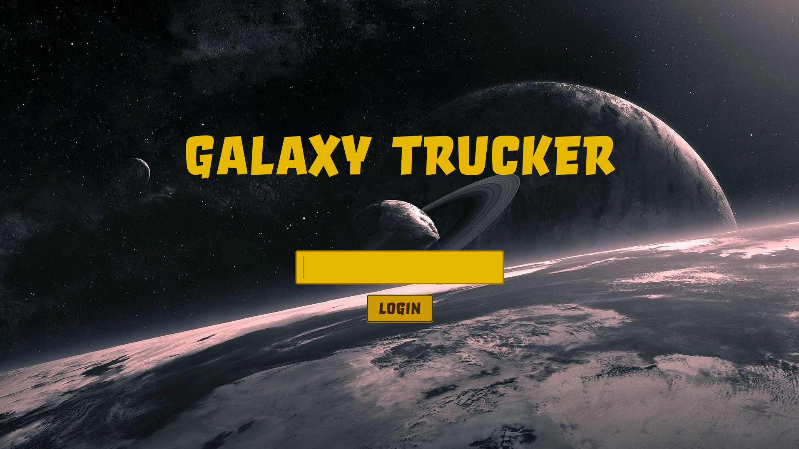
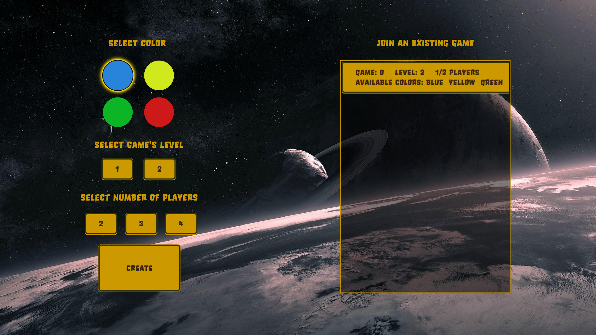
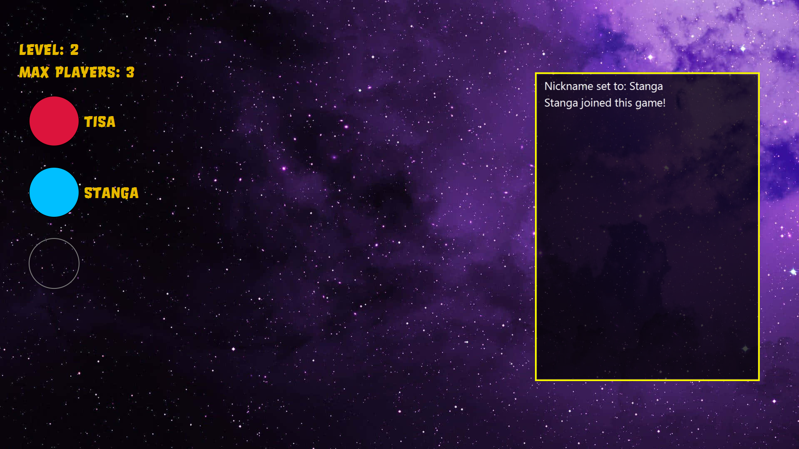
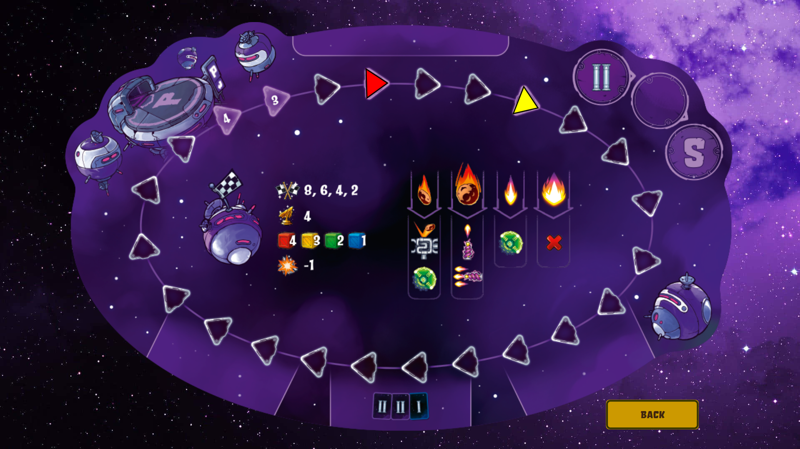
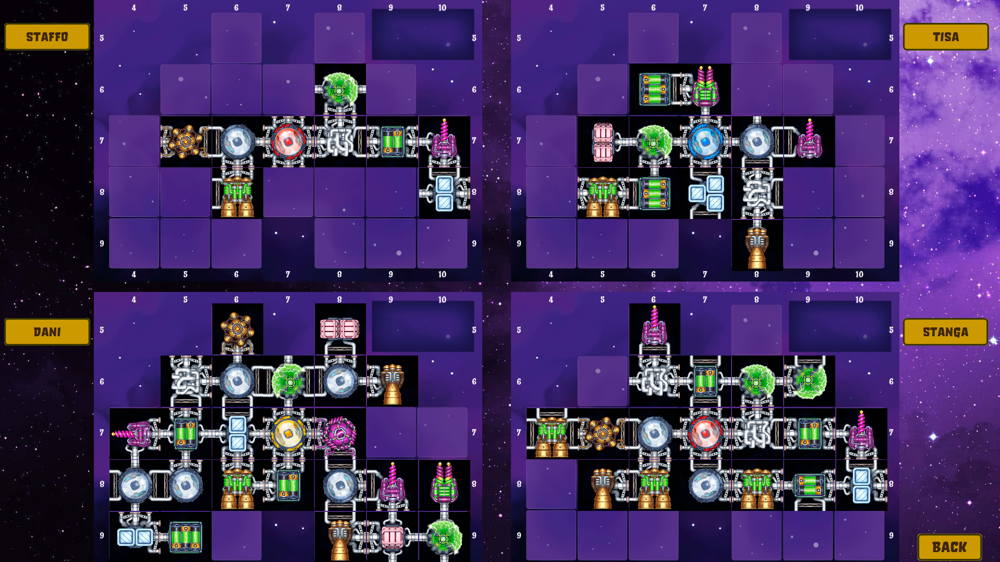
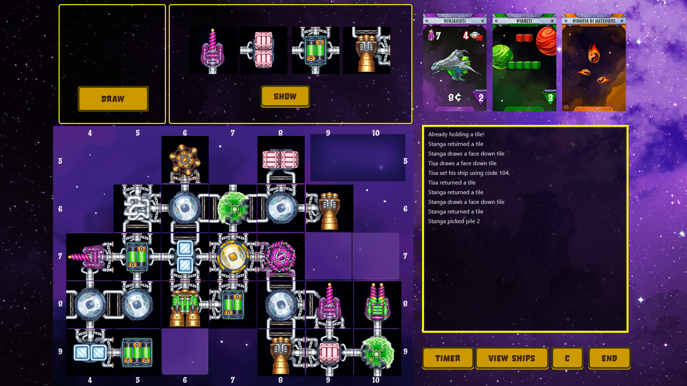
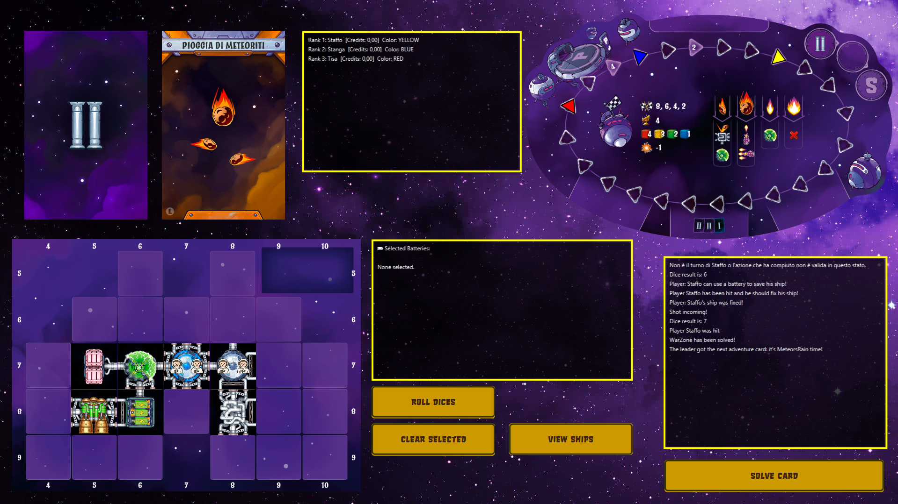
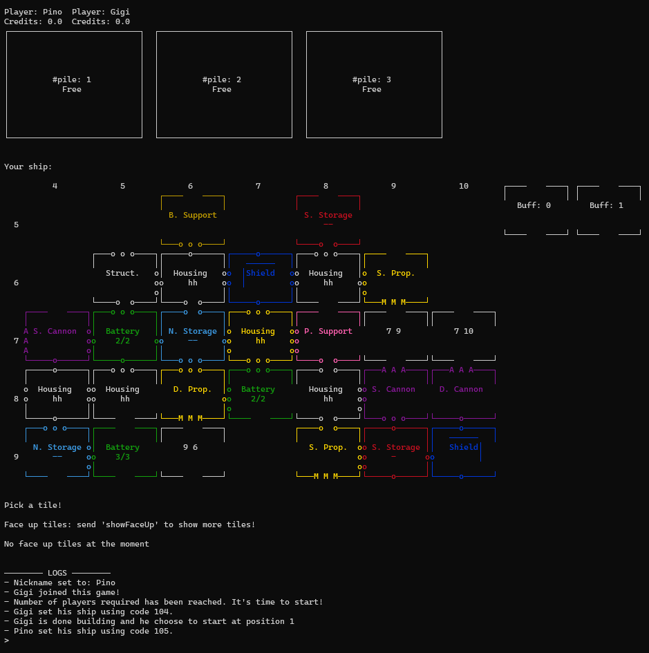
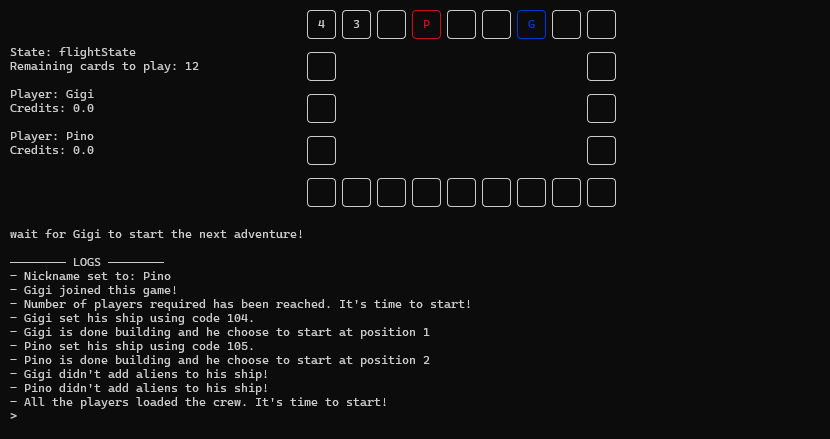
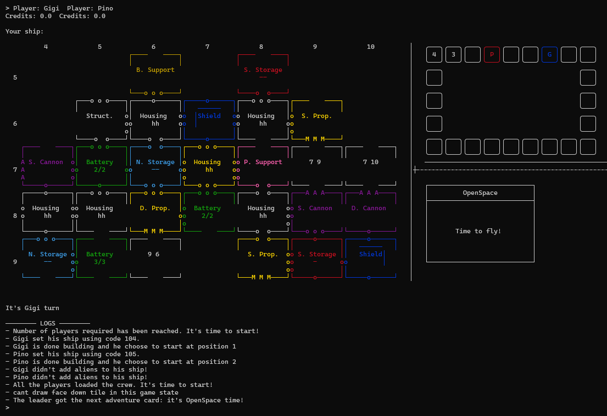

# Galaxy Trucker

# Implemented Features
| FEATURE             |  |
|---------------------|--|
| Simplified Rules    | ✅ |
| Complete Rules      | ✅ |
| TUI                 | ✅ |
| GUI                 | ✅ |
| RMI                 | ✅ |
| Socket              | ✅ |
| Test Flight         | ✅ |
| Multigame           | ✅ |
| Resilience          | ❌ |
| Persistence         | ❌ |

Grade: 30/30

## Repository Structure

- `deliverables/`
    - `artifact/` — Packaged JAR file.
    - `coverage/` — Test coverage reports.
    - `javadoc/` — Generated Java documentation.
    - `uml/` — UML diagrams and related documentation.

- `src/`
    - `main/`
        - `java/` — Main Java source code.
        - `resources/` — Application resources.
    - `test/`
        - `java/` — JUnit test source code.

---

## Requirements

- Java JDK 23


## Run the server
```bash
java -jar <path to the .jar file> server
```

If RMI connections don't work add the following parameter
```bash
-Djava.rmi.server.hostname=<server ip>
```

On Windows if RMI connections doesn't still work: 

- Open Control Panel → System and Security → Windows Defender Firewall → Allow an app or feature through Windows Defender Firewall.

- Click Change settings.

- Ensure Java(TM) Platform SE binary is checked for both Private and Public networks.

## Run the client with RMI
```bash
java -jar <path to the .jar file> client rmi <server ip> 9696 <TUI/GUI>
```

## Run the client with Socket
```bash
java -jar <path to the .jar file> client tcp <server ip> 4200 <TUI/GUI>
```


## GUI

### Login


### Pre-Lobby


### Lobby


### Map


### Others POV


### Build Phase


### Adventure Card Phase


---

## TUI

### Build Phase


### Players Map


### Adventure Card Phase


## Copyright and License

*Galaxy Trucker* is a board game developed and published by Cranio Creations Srl. The graphic assets in this project that are derived from the original board game are used with prior approval from Cranio Creations Srl for educational purposes only. Distribution, copying, or reproduction of these assets and images in any form outside this project is prohibited, as is the redistribution or publication of the assets and images for purposes other than those stated above. Commercial use of these assets is also prohibited.

